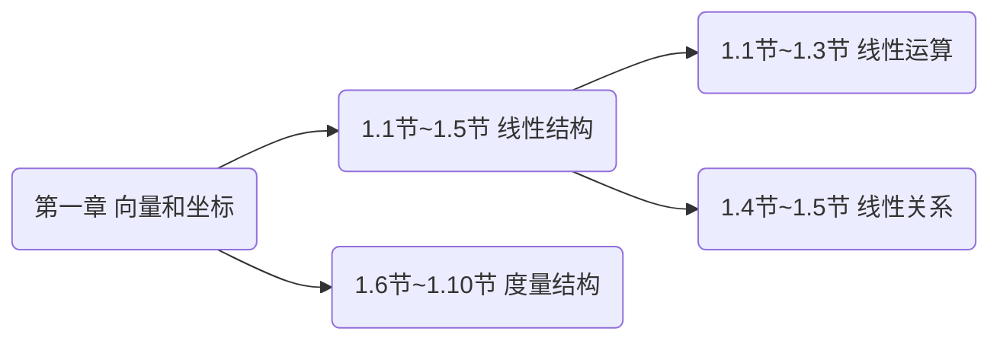

# {{ page.title }}

---

## 目录
+ [一、引言](#part1)
+ [二、向量的定义](#part2)
+ [三、向量的加法](#part3)
+ [四、向量的数乘](#part4)
+ [五、小结](#part5)

---

## 一、引言

各位未来的数学工作者们，大家早上好。今天是我们**空间解析几何**的第一次课。我们就从第一章说起。第一章的核心其实是在讲**向量空间**。它又可以分成两部分，后五节讲的是向量空间的**度量结构**，前五节讲的是向量空间的**线性结构**。

前五节**线性结构**又可以分为两部分：`1.1节~1.3节`讨论**线性运算**，`1.4节~1.5节`讨论**线性关系**。

这次课我们讨论向量的**线性运算**，主要内容包括：向量的**定义**，向量的**加法**，向量的**数乘**。

有同学可能有想法了：*我们在中学已经学过了这些内容了啊*

既然如此，那么就请你们思考几个问题吧：

+ 在高中所学的解析几何里，最重要的内容是什么？
    `答：圆锥曲线。`
+ 这些圆锥曲线的方程是建立在什么坐标系下的？
    `答：平面直角坐标系。`
+ 平面直角坐标系是什么样的？
    `答：两条相互垂直的数轴，垂足是原点，两条数轴的单位长度一样。`
+ 如果两个坐标轴不垂直会怎么样？

+ 如果两个坐标轴上的单位长度不相等会怎么样？

+ 在立体空间中能不能建立坐标系？能建立什么样的坐标系？

+ 为什么平面上的坐标系有两个坐标轴，而立体空间中的坐标系有三个坐标轴？
    `有同学说因为平面是2维的，立体是3维的。那么什么叫2维，什么叫3维？`

+ 超越我们直观体验的4维空间、5维空间、甚至$`n`$维空间应该怎么刻画呢？$n$

---

## 二、向量的定义

---

## 三、向量的加法

---

## 四、向量的数乘

---

## 五、小结

---

{{ page.date|date_to_string }}