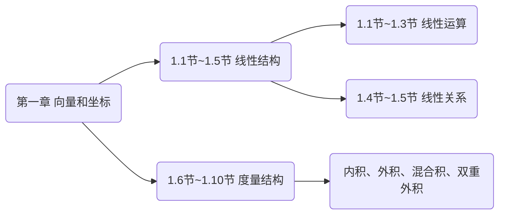

# 第一讲  向量的线性运算（1.1~1.3节）

---

## 目录
+ <a href="#1"> 一、引言 </a>
+ <a href="#2"> 二、向量的定义</a>
+ <a href="#3"> 三、向量的加法</a>
+ <a href="#4"> 四、向量的数乘</a>
+ <a href="#5"> 五、小结</a>

---

## <a name="1">一、引言 </a>

各位未来的数学工作者们，大家早上好。今天是我们**空间解析几何**的第一次课。我们就从第一章说起。第一章的核心其实是在讲**向量空间**。它又可以分成两部分，后五节讲的是向量空间的**度量结构**，前五节讲的是向量空间的**线性结构**。

前五节**线性结构**又可以分为两部分：1.1节-1.3节讨论**线性运算**，1.4节-1.5节讨论**线性关系**。

这次课我们讨论向量的**线性运算**，主要内容包括：向量的**定义**，向量的**加法**，向量的**数乘**。

有同学可能有想法了：*我们在中学已经学过了这些内容了啊*

既然如此，那么就请你们思考几个问题吧：

---

### 1.1. 思考

+ 在高中所学的解析几何里，最重要的内容是什么？
>学生答：圆锥曲线
+ 这些圆锥曲线的方程是建立在什么坐标系下的？
>学生答：平面直角坐标系
+ 平面直角坐标系是什么样的？
>学生答：两条相互垂直的数轴，垂足是原点，两条数轴的单位长度一样。
+ 如果两个坐标轴不垂直会怎么样？
>教师答：对某些问题而言不垂直的坐标轴反而更方便
+ 如果两个坐标轴上的单位长度不相等会怎么样？
>教师答：两个单位长度必须一样吗？如果不影响问题的解决，也许会更有利哦
+ 在立体空间中能不能建立坐标系？能建立什么样的坐标系？
>教师答：高中学过空间直角坐标系，但它同样不是惟一的选择
+ 为什么平面上的坐标系有两个坐标轴，而立体空间中的坐标系有三个坐标轴？
>教师答：有同学说因为平面是2维的，立体是3维的。那么什么叫2维，什么叫3维？`
+ 超越我们直观体验的4维空间、5维空间、甚至$n$维空间应该如何刻画呢？
>教师答：所有这些问题归根结底都是**坐标系**的问题！

---

### 1.2. 关键问题

那么对于上述纷繁复杂的各种坐标系，我们能否建立一个严密而又统一的数学理论，来回答如下问题呢：
>坐标系为什么可以建立起来？又是如何建立起来的呢？

这其实是我们第一章前五节所要解决的根本问题。

要想解决这个问题，我们首先应该思考一下：**我们要用坐标系来干什么**？或者说，**坐标系的本质作用是什么**？比如平面坐标系，它究竟起了什么作用？

---

## <a name="2">二、向量的定义 </a>

---

## <a name="3">三、向量的加法 </a>

---

## <a name="4">四、向量的数乘 </a>

---

## <a name="5">五、小结 </a>