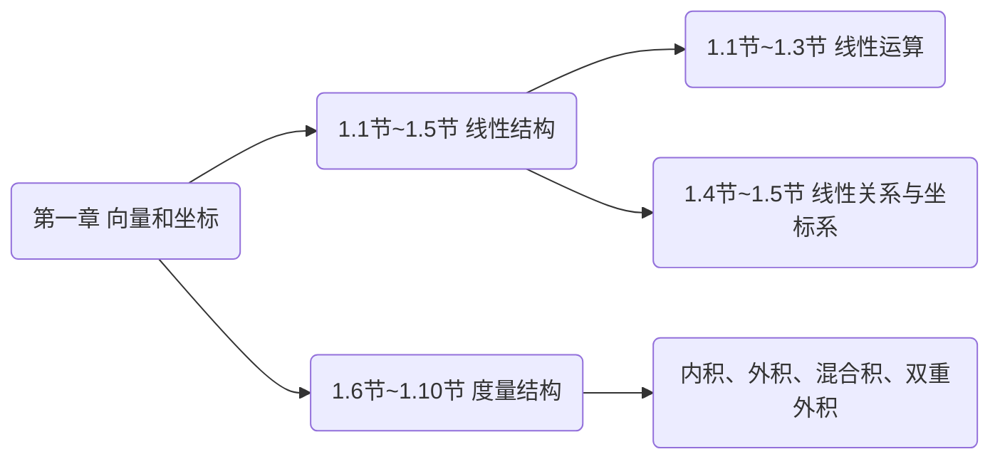
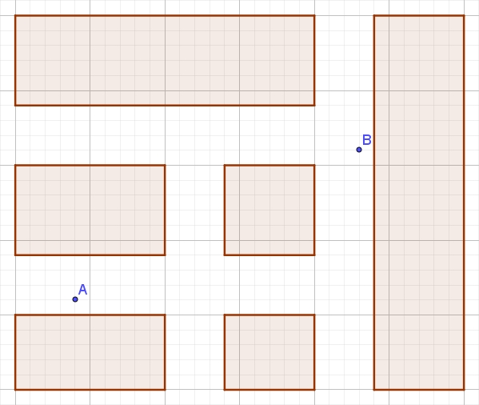
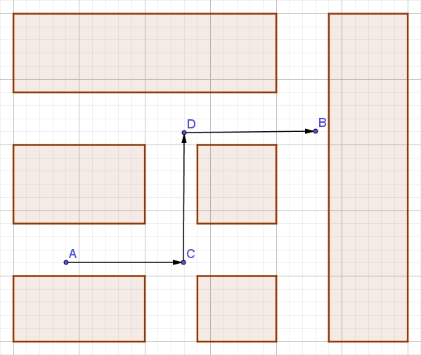
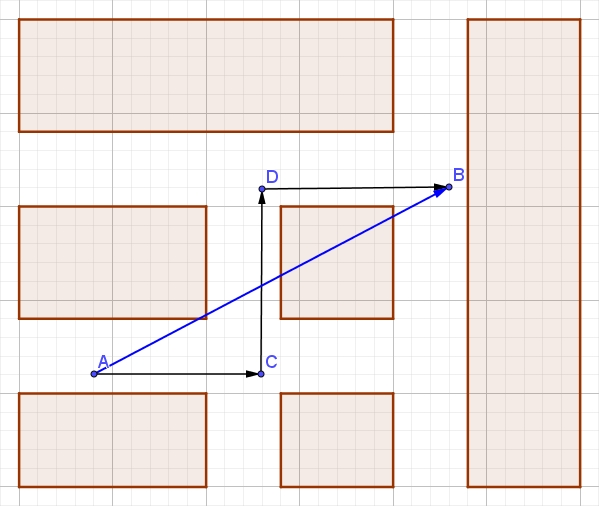
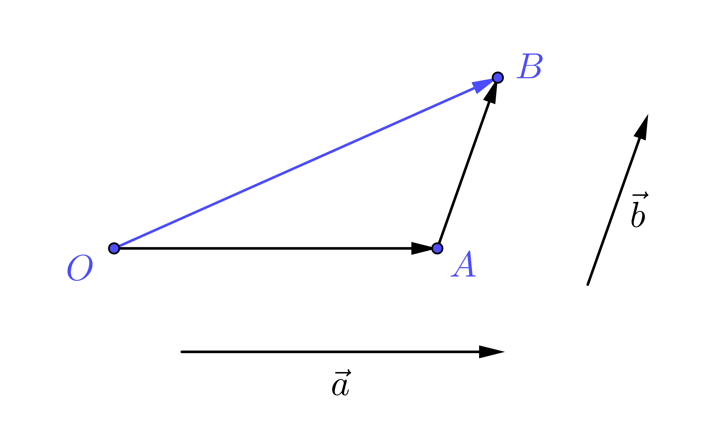
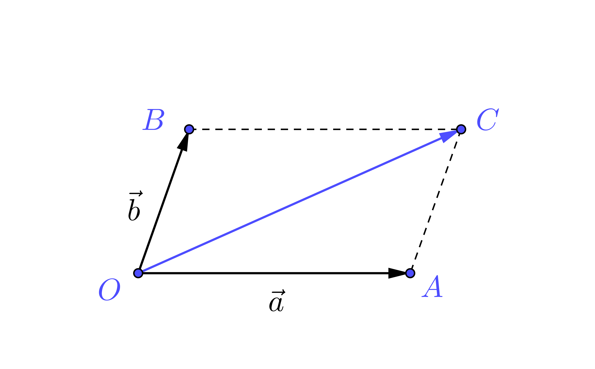
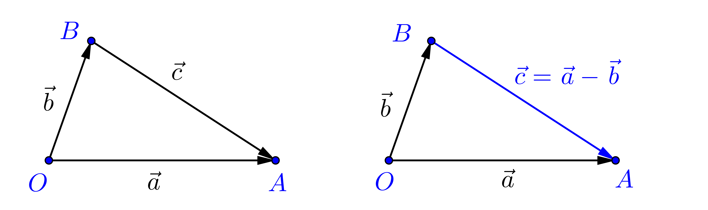
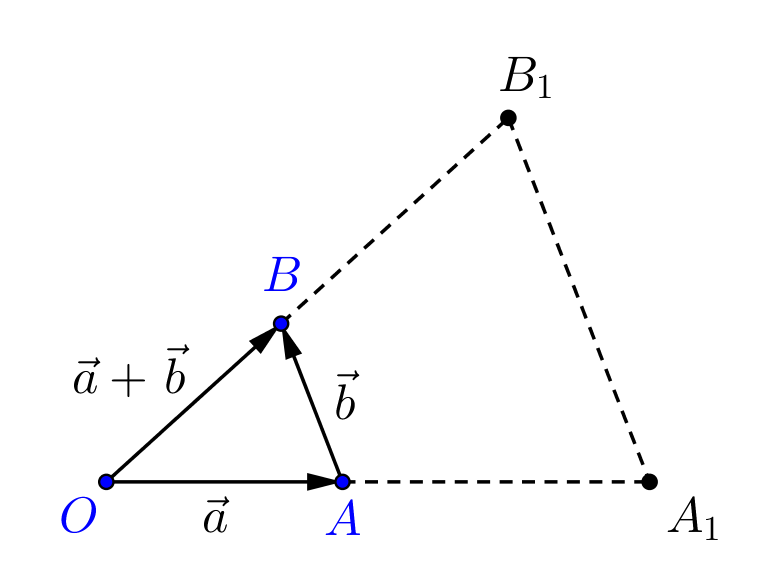

# 第一讲  向量的线性运算（1.1~1.3节）

---

## 目录

+ <a href="#1"> 一、引言 </a>
+ <a href="#2"> 二、向量的定义</a>
+ <a href="#3"> 三、向量的加法</a>
+ <a href="#4"> 四、向量的数乘</a>
+ <a href="#5"> 五、小结</a>
+ <a href="/html/lecture/analysegeo.html"> 返回《空间解析几何》 </a>

---

## <a name="1">一、引言 </a>

各位未来的数学工作者们，大家早上好．我们这门课叫**空间解析几何**，是数学专业本科生的一门专业基础课．我们使用的教材是吕林根老师编写的《解析几何》（第四版），由高教出版社出版．另外推荐两本参考书：丘维声的《解析几何》（第三版）和尤承业的《解析几何》，二者都是北大出版社出版的．

<table border="0" align="center">
<tr>
<td></td>
<td></td>
<td></td>
</tr>
</table>

今天是我们**空间解析几何**的第一次课．我们就从第一章说起．第一章的核心其实是在讲**向量空间**．它又可以分成两部分，后五节讲的是向量空间的**度量结构**，前五节讲的是向量空间的**线性结构**．

前五节**线性结构**又可以分为两部分：1.1节-1.3节讨论**线性运算**，1.4节-1.5节讨论**线性关系与坐标系**．

这次课我们讨论向量的**线性运算**，主要内容包括：向量的**定义**，向量的**加法**，向量的**数乘**．

有同学可能有想法了：*我们在中学已经学过了这些内容了啊*

既然如此，那么就请你们思考几个问题吧：

---

### 1.1. 思考

+ 在高中所学的解析几何里，最重要的内容是什么？
>学生答：圆锥曲线
+ 这些圆锥曲线的方程是建立在什么坐标系下的？
>学生答：平面直角坐标系
+ 平面直角坐标系是什么样的？
>学生答：两条相互垂直的数轴，垂足是原点，两条数轴的单位长度一样．
+ 如果两个坐标轴不垂直会怎么样？
>教师答：对某些问题而言不垂直的坐标轴反而更方便
+ 如果两个坐标轴上的单位长度不相等会怎么样？
>教师答：两个单位长度必须一样吗？如果不影响问题的解决，也许会更有利哦
+ 在立体空间中能不能建立坐标系？能建立什么样的坐标系？
>教师答：高中学过空间直角坐标系，但它同样不是惟一的选择
+ 为什么平面上的坐标系有两个坐标轴，而立体空间中的坐标系有三个坐标轴？
>教师答：有同学说因为平面是2维的，立体是3维的．那么什么叫2维，什么叫3维？`
+ 超越我们直观体验的4维空间、5维空间、甚至$n$维空间应该如何刻画呢？
>教师答：所有这些问题归根结底都是**坐标系**的问题！

---

### 1.2. 关键问题

那么对于上述纷繁复杂的各种坐标系，我们能否建立一个严密而又统一的数学理论，来回答如下问题呢：
>坐标系为什么可以建立起来？又是如何建立起来的呢？

这其实是我们第一章前五节所要解决的根本问题．

要想解决这个问题，我们首先应该思考一下：**我们要用坐标系来干什么**？或者说，**坐标系的本质作用是什么**？比如平面坐标系，它究竟起了什么作用？

>[讨论后，教师回答]它的作用在于使用有限手段，也就是两个参数，来描述平面上任何一个点．而平面上的点，也就是平面上的位置．平面上有多少个位置呢？无限多个．所以坐标系的本质作用在于**以有限描述无限**．描述无限个什么？无限个位置！

那么，我们在日常生活中是如何描述某个位置的呢？

---

### 1.3. 一个问路问题

比如，你现在正在下图中的$A$点处沿着马路向东行走，这时候有个人向你问路，问你$B$怎么走．你会怎么描述$B$的位置呢？

你可能会说：顺着我走的这个方向，见到第一个十字路口左拐，一直走，等见到三叉路口了就右拐，走到头就看到$B$了．

也就是这个路线：

实际上，如果以$A$为参考点，我们可以使用这个方式描述出这个地图中任何一点的位置．那么我们使用的是什么方式呢？

>我们无非是使用了几条首尾相接的有向线段，这就是你们中学所学过的**向量**

那么，在描述点的位置时，为什么我们不直接用点呢？

>点有一个致命的问题，点的集合是松散的、没有结构的，点与点的相互关系必须借助于其他几何对象实现．而向量则不同．某些向量的集合，它们在直观上带有一种结构．以上图为例，我们实际要得到的是$B$的位置，实际上我们本来只需要向量$\overrightarrow{AB}$就够了，但是城市交通让我们不能沿直线到达$B$，于是我们使用了向量$\overrightarrow{AC}$、$\overrightarrow{CD}$和$\overrightarrow{DB}$．事实上，这三个向量恰好等效于向量$\overrightarrow{AB}$，这正是我们中学所学过的**向量加法**．换句话说，向量之间的运算，将不同向量联系了起来，从而使向量的集合产生了结构．即，**运算产生了结构**．

我们这里要探讨**坐标系是如何构造起来的**，我们需要研究的运算有两种，其一就是上面提到的**向量加法**．但是只有向量加法，我们并不能实现**以有限描述无限**．我们还需要一种运算，就是你们中学所学的**向量数乘**．这两种运算合称**线性运算**．这次课我们将系统地回顾和学习向量的加法与数乘这两种线性运算．下次课我们就要探究一下，线性运算是如何实现**以有限描述无限**的．

首先我们从向量的定义开始，虽然你们中学已经学过，但是我们的数学是需要**体系化**的，任何一个概念，如果它众所周知，那么我们可以将其作为基本概念，而不加定义，比如，点、直线、平面；而其他概念，则都应该从定义出发．

---

## <a name="2">二、向量的定义 </a>

---

### 2.1. 何为向量

**向量**，就是既有大小又有方向的量．更具体一点说，在我们空间解析几何这门课上，向量就是用**有向线段**来表示的，而有向线段的起点和终点分别就是对应向量的**起点**和**终点**．那么接下来，如何书写向量呢？课本上使用了粗体的英文字母，但是我要求你们手写的时候，必须给它头上戴上箭头，例如$\vec{a}$，否则将无法与实数相区分．如果已经明确了起点和终点，我们还可以用起点和终点表示向量，同样地，必须戴上箭头，例如$\overrightarrow{AB}$．

我们刚才说了向量是既有大小又有方向的量，一个向量的大小，也被称为**向量的模**，也就是对应**有向线段的长度**，因此也称为**向量的长度**．向量$\vec{a}$的模，记作$|\vec{a}|$．

>+ 模为零的向量叫做**零向量**，记作$\vec{0}$，其方向任意，不确定
>+ 模为1的向量叫做**单位向量**，向量$\vec{a}$方向上的单位向量记作$\vec{a}^0$

---

### 2.2. 共线与共面

前面说到，模和方向是向量的两大要素，所以我们作如下定义．
>模相等、方向相同的两个向量为**相等**的向量；而模相等、方向相反的两个向量则叫做**相反**向量，其中一个称为另一个的**反向量**，向量$\vec{a}$的反向量记作$-\vec{a}$．

由向量相等的定义可以看出：**平移不改变向量**．所以对两个向量而言，**平行和共线是一回事**．

>一般来说，平行于同一直线的一组向量叫做**共线向量**；平行于同一平面的一组向量叫做**共面向量**．对于这二者，后面我们会给出更深刻的刻画．

>由于零向量方向不定，所以零向量可以和任何共线的向量组共线，也可以和任何共面的向量组共面．

---

## <a name="3">三、向量的加法 </a>

我们在前面的“问路问题”中，已经见识过了向量的加法．下面给出严格的定义．

---

### 3.1. 向量加法的定义

>设已知向量$\vec{a}$和$\vec{b}$以及空间中任意一点$O$．作$\overrightarrow{OA}=\vec{a}$，$\overrightarrow{AB}=\vec{b}$．记向量$\overrightarrow{OB}=\vec{c}$．我们定义$\vec{c}$叫做$\vec{a}$和$\vec{b}$的**和**，记作$\vec{c}=\vec{a}+\vec{b}$．

向量加法的上述定义也称为向量加法的**三角形法则**．

如果我们不是将向量$\vec{a}$和$\vec{b}$首尾相接，而是将它们的起点归结于一点，我们很容易证明下面的**平行四边形法则**．

>**定理 1.2.1** （向量加法的平行四边形法则） 如果以两个向量$\overrightarrow{OA}$和$\overrightarrow{OB}$为邻边作平行四边形$OACB$，那么对角线向量$\overrightarrow{OC}=\overrightarrow{OA}+\overrightarrow{OB}$．

---

### 3.2. 向量加法的运算律

从向量加法的定义（即三角形法则）和平行四边形法则出发，可以很容易证明，向量加法满足如下四条运算律．

>**定理 1.2.2** （向量加法的运算律） 
>+ 交换律：$\vec{a}+\vec{b}=\vec{b}+\vec{a}$； 
>+ 结合律：$(\vec{a}+\vec{b})+\vec{c}=\vec{a}+(\vec{b}+\vec{c})$； 
>+ 零向量律：$\vec{a}+\vec{0}=\vec{a}$； 
>+ 反向量律：$\vec{a}+(-\vec{a})=\vec{0}$．

需要指出的一点是，运算不是天然的，是我们定义出来，所以运算律也不是天然的，应该由定义和其他已知理论证明出来．我们第四次课就会遇到**不满足交换律和结合律**的运算，所以建议大家课下自行证明这四个运算律．

尤其需要指出的是**结合律**．由于结合律的成立，所以多个向量求和的时候可以不加括号．也是因为结合律的成立，多个向量求和事实上满足**多边形法则**．

>**多个向量求和的多边形法则** 设$\overrightarrow{OA_1}=\overrightarrow{a_1}$，$\overrightarrow{A_1A_2}=\overrightarrow{a_2}$，...，$\overrightarrow{A_{n-1}A_n}=\overrightarrow{a_n}$．那么
$$\overrightarrow{a_1}+\overrightarrow{a_2}+\dots+\overrightarrow{a_n}=\overrightarrow{OA_n}.$$

它之所以成立，是因为我们可以逐次使用三角形法则．

---

### 3.3. 向量减法

既然有了向量加法的定义，我们可以将向量减法定义为向量加法的逆运算，即：

>如果$\vec{b}+\vec{c}=\vec{a}$， 那么我们就定义$\vec{c}$为$\vec{a}$与$\vec{b}$的**差**，记作$\vec{c}=\vec{a}-\vec{b}$， 并且称运算$\vec{a}-\vec{b}$为向量$\vec{a}$与$\vec{b}$的**减法**．

上述向量减法的定义也称为**向量减法的三角形法则**，只需要记住：
>两个向量的差总是指向被减向量．

由于向量加法和减法都满足三角形法则，而三角形的一边之长小于等于另外两边长度之和，因而我们有如下不等式．

>**三角不等式**
$$|\vec{a}\pm\vec{b}|\le |\vec{a}|+|\vec{b}|.$$

借助于向量减法的定义和向量加法的运算律，我们可以证明如下结论．
>**向量减法与反向量加法的等效性**
$$\vec{a}-\vec{b}=\vec{a}+(-\vec{b}).$$

>**证明.** 设$\vec{c}=\vec{a}-\vec{b}$． 
由向量减法的定义可知：$\vec{c}+\vec{b}=\vec{a}.$
等式两边同时加上$(-\vec{b})$，再由向量加法的结合律可知：
\[\vec{c}+(\vec{b}+(-\vec{b}))=\vec{a}+(-\vec{b}).\]由反向量律和零向量律可知：$\vec{c}=\vec{a}+(-\vec{b})$．$\Box$

我们之所以要将如此显而易见的结论的证明写下来，是为了向大家强调几件事：

+ 看似平凡而直观的结论，其证明未必是平凡的，它甚至可能是错的．数学专业的学生应该养成严谨的治学态度．
+ 证明的书写是有一定格式的．我们要求：
    - 以“证明”二字开始，随后有一个点（注意不是冒号）．
    - 以$\Box$结束，$\Box$是证明结束的标志，它表示这之后的文本与此证明无关．
    - 凡是命题中没有出现的名称，应该设出，例如上述证明中的$\vec{c}$．
    - 凡是添加新的操作，如辅助线等，必须以文字明确说明，禁止仅以“如图所示”等含糊的话语说明．
+ 禁止一切形式的“循环论证”．
+ 最后，数学证明是严谨的演绎推理．证明中每一个小结论的出现，必须要有“三段论”，即
    - 大前提（所依据的理论，必须是已经证明过的正确的理论而非你的臆想）
    - 小前提（条件）
    - 结论．
+ 其中，大前提或小前提可以酌情省略．

另外，这个证明还告诉我们一件有趣的事情：
>**向量等式可以移项．**

---

## <a name="4">四、向量的数乘 </a>

前面我们已经讲向量的加法，这是两种线性运算之一．
但是只有向量加法，并不能实现我们**以有限描述无限**的目的，我们还需要第二种线性运算，那就是**向量的数乘**．

---

### 4.1. 向量数乘的定义

> 设$\lambda$是一个实数，$\vec{a}$是一个向量．我们构造一个新向量$\vec{b}$，满足 
>+ $|\vec{b}|=|\lambda|\cdot|\vec{a}|$；
>+ 当$\lambda>0$时，$\vec{b}$与$\vec{a}$同向；当$\lambda<0$时，$\vec{b}$与$\vec{a}$反向．
>
>那么，我们就说$\vec{b}$是$\lambda$和$\vec{a}$的**数乘**，记作$\vec{b}=\lambda\vec{a}$．

使用向量数乘的定义，我们还能得到一个意外收获，那就是前面提到的向量$\vec{a}^0$，它是非零向量$\vec{a}$方向上的单位向量．借助向量数乘的定义，我们可以得到如下刻画．

>**非零向量的单位化** 若$\vec{a}$是非零向量，那么\[\vec{a}^0=|\vec{a}|^{-1}\vec{a}.\]

---

### 4.2. 向量数乘的运算律

与向量加法类似地，向量数乘也满足四条运算律．

>**定理1.3.1（向量数乘的运算律）** 向量数乘满足如下运算律：
>+ 幺律：$1\cdot \vec{a}=\vec{a}$；
>+ 结合律：$\lambda(\mu\vec{a})=(\lambda\mu)\vec{a}$；
>+ 第一分配律：$(\lambda+\mu)\vec{a}=\lambda\vec{a}+\mu\vec{a}$；
>+ 第二分配律：$\lambda(\vec{a}+\vec{b})=\lambda\vec{a}+\lambda\vec{b}$．

前三条运算律非常简单，请大家课下自行证明．需要指出的是，使用向量数乘的结合律以及非零向量的单位化，我们还能得到向量数乘的一个基本性质．

>**向量数乘的基本性质** 若$\vec{a}\parallel\vec{b}$且$\vec{a}$**非零**．那么存在唯一的实数$\lambda$，使得$\vec{b}=\lambda\vec{a}$．

>**证明.** （存在性）因为$\vec{a}\ne\vec{0}$，所以$|\vec{a}|\ne 0$．因为$\vec{a}\parallel\vec{b}$，所以$\vec{a}$和$\vec{b}$同向或反向．
>+ 如果$\vec{a}$与$\vec{b}$同向，则取$\lambda=|\vec{b}|\cdot|\vec{a}|^{-1}$，那么$\lambda\vec{a}=(|\vec{b}|\cdot|\vec{a}|^{-1})\vec{a}=|\vec{b}|\cdot(|\vec{a}|^{-1}\vec{a})=|\vec{b}|\vec{a}^0=|\vec{b}|\vec{b}^0=\vec{b}$.
>+ 如果$\vec{a}$与$\vec{b}$反向，则取$\lambda=-|\vec{b}|\cdot|\vec{a}|^{-1}$，那么$\lambda\vec{a}=(-|\vec{b}|\cdot|\vec{a}|^{-1})\vec{a}=-|\vec{b}|\cdot(|\vec{a}|^{-1}\vec{a})=-|\vec{b}|\vec{a}^0=|\vec{b}|\vec{b}^0=\vec{b}$.
>
>（唯一性）假设存在两个不同实数$\lambda_1$和$\lambda_2$，使得$\vec{b}=\lambda_1\vec{a}$并且$\vec{b}=\lambda_2\vec{a}$，二式作差可得：$\vec{0}=(\lambda_1-\lambda_2)\vec{a}$，但$\vec{a}\ne\vec{0}$，所以$\lambda_1=\lambda_2$. $\Box$

>**思考**：条件“$\vec{a}$非零”能否省略？如果删除了这个条件会在什么地方出问题？
>**答**：假如$\vec{a}$是零向量而$\vec{b}$不是零向量，那么这里的实数$\lambda$显然无法找到．

下面我们给出**第二分配律**的证明．

>**证明.** 当$\lambda=0$、$\vec{a}=\vec{0}$或$\vec{b}=\vec{0}$时，结论是平凡的．我们不妨设上述三者都非零．如果$\vec{a}\parallel\vec{b}$，由于$\vec{a}$和$\vec{b}$都不是零向量，所以由数乘的基本性质可知，存在实数$\mu$，使得$\vec{b}=\mu\vec{a}$，所以$\lambda(\vec{a}+\vec{b})=\lambda(\vec{a}+\mu\vec{a})$．由第一分配律可知，此式$=\lambda[(1+\mu)\vec{a}]$．由结合律可得，上式$=(\lambda+\lambda\mu)\vec{a}$．由第一分配律可知，上式$=\lambda\vec{a}+\lambda\mu\vec{a}=\lambda\vec{a}+\lambda\vec{b}$．以下我们只需考虑$\vec{a}$与$\vec{b}$不共线的情况．
>
>设$\vec{a}$与$\vec{b}$不共线．令$\overrightarrow{OA}=\vec{a}$，$\overrightarrow{AB}=\vec{b}$，那么$OAB$构成一个三角形，所以$\overrightarrow{OB}=\vec{a}+\vec{b}$．不妨设$\lambda>0$．延长$OA$至$A_1$使得$\overrightarrow{OA_1}=\lambda\overrightarrow{OA}=\lambda\vec{a}$，延长$OB$至$B_1$使得$\overrightarrow{OB_1}=\lambda\overrightarrow{OB}=\lambda(\vec{a}+\vec{b})$，连接$A_1B_1$（见下图）．那么$\triangle OAB$与$\triangle OA_1B_1$相似．所以$AB\parallel A_1B_1$，所以$\overrightarrow{A_1B_1}=\lambda\vec{b}$．因此，$\lambda(\vec{a}+\vec{b})=\overrightarrow{OB_1}=\overrightarrow{OA_1}+\overrightarrow{A_1B_1}=\lambda\vec{a}+\lambda\vec{b}$. $\Box$

我们的证明中使用了**不妨设**这个词，它表示**不妨设**后面的内容不影响证明，或者**不妨设**所隐藏的证明与我们所写出的证明相似．例如我们的证明中，只是讨论了$\lambda>0$的情况，实际上$\lambda<0$的情况与此类似．请大家课下自行补充相关证明．

---

### 4.3. 例题

关于向量数乘的应用，我们看一下课本例2.

>**例2.** 使用向量法证明：三角形两边的中位线平行于第三边，且等于第三边长度的一半．

>**证明.** 设$\triangle ABC$两边$AB$和$AC$的中点分别为$M$和$N$，那么\[\overrightarrow{MN}=\frac{1}{2}(\overrightarrow{MA}+\overrightarrow{AN})=\frac{1}{2}\overrightarrow{BA}+\frac{1}{2}\overrightarrow{AC}=\frac{1}{2}(\overrightarrow{BA}+\overrightarrow{AC})=\frac{1}{2}\overrightarrow{BC}.\]由数乘的定义和性质可知，$\overrightarrow{MN}\parallel\overrightarrow{BC}$且$|\overrightarrow{MN}|=\frac{1}{2}|\overrightarrow{BC}|$． $\Box$

请大家课下自行证明1.1节-1.3节的其他例题．

---

## <a name="5">五、小结 </a>

---

+ 关键问题
+ 核心概念
+ 两种运算
    - 定义、性质、运算律
    - 合称**线性运算**

**线性运算**是坐标系得以建立的根本原因，下一讲我们将探究如何使用线性运算掌控无限个向量，从而建立起坐标系．

---

### 作业

+ 13页：2（2）（3），3
+ 14页：6，10

### 思考题

+ 14页：12，13

---

>**好好学习，天天向上．做好作业，下次再见！**

<a href="/html/lecture/analysegeo.html"> 返回《空间解析几何》 </a>