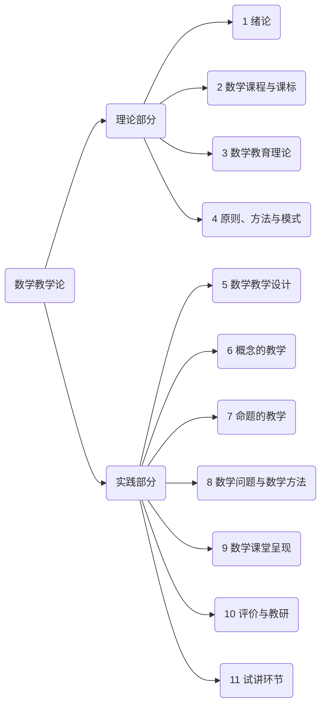

# 第一讲 绪论

---

## 目录

+ <a href="#0"> 〇、开场白 </a>
+ <a href="#1"> 一、数学教师的知识结构</a>
+ <a href="#2"> 二、本课程的具体内容</a>
+ <a href="#3"> 三、教师资格考试简介</a>
+ <a href="#4"> 四、我们怎么做？</a>
+ <a href="#5"> 五、自我介绍和答记者问</a>
+ <a href="/html/lecture/mathTeacher.html"> 返回《数学教学论》 </a>

---

## <a name="0">〇、开场白 </a>

各位未来的数学老师们，各位即将战斗在数学教育第一线的战友们，大家上午好！ 

从今以后，在我这个课上，我对你们的称呼就不是“小张同学”、“小王同学”、“小李同学”……而是“小张老师”、“小王老师”、“小李老师”．我希望你们以一个未来数学教师的立场来上我这个课，同时以一个未来数学老师的责任感和使命感来要求自己．尤其是我们同学当中的师范生们，你们将来大部分会成为数学老师．其实我也是师范生出身，我是山东师范大学数学与应用数学专业2004级的本科师范生．在收到录取通知书以后，我当时一直有一个疑问：

>究竟什么叫==师范==呢？

我的疑问后来在入学的当天得到了解答．当时我们大一新生在山东师大的北校区，在济南水屯村附近．当时那里比较荒凉，所以我在公交车上很远就看到北校区的大楼上有八个大字
>“学高为师，身正为范”

据说这是陶行知的话，从此以后，“师范”的这个解释牢牢地刻在了我的心中．

首先说后面四个字，浓缩一下，这里说的是“师德”．这些年来，我们从各种媒体见到了太多的有违教师职业道德的事情，其中有大学老师、中学老师、甚至小学老师，尤其近些年还出现幼儿园老师的问题．我觉得我们作为老师应该多一份使命感和责任感，应该对得起人家恭恭敬敬地叫你的一声“老师”．

当然，这并不是我们这个课程所需要讨论的内容．我们还是重点来看一下前面这四个字．这四个字向我们提出了一个深刻的问题：

>一个合格的数学教师应该具备什么样的知识结构？

---

## <a name="1">一、数学教师的知识结构 </a>

### 1.1. 数学专业知识

过去我们说，要给学生一滴水，你需要一桶水；在现在这个知识爆炸的时代，也许一桶水还不够，可能你需要一个水库．比如，山东省很多地方招聘高中数学老师，必须要有硕士学位．甚至在北京上海等地广泛出现一个现象：大量名校的硕士博士竞聘高中数学教师的职位．

>有的人认为这是唯学历论，真的是这样吗？

请大家来看一下，这是2019年上半年教师资格考试（高中数学）中的科目三《数学学科知识与教学能力》的试卷真题：

<a href="/html/lecture/mathTeacher/gaozhong/2019-1-e.html">2019年上半年教师资格考试（高中数学）《数学学科知识与教学能力》</a>

从这份试卷中我们可以看出：第2、3、4、5、6、10、11、14题都是大学数学专业课的内容．你们念大一的时候，我就教过你们．当时就有同学说：
>“我只是想毕业当个中学数学老师，中学数学用不着数学分析、高等代数这些东西”

可以明确地告诉你：如果这些大学数学系的专业课你学不好，别说能不能当中学数学老师，即使是当中学数学老师的==资格==你都不具备！

不仅仅是我这样说，国际数学教育委员会的第一任主席、著名数学家和数学教育家**克莱因**曾经一再强调：
>+ 数学教师应具备较高的数学观点，只有观点高了，事物才能显得明了而简单．
>+ 一个称职的数学教师应当掌握和了解数学的各种概念、方法及其发展与完善的过程，以及数学教育演化的经过．

克莱因有一本著作就叫《高观点下的初等数学》．我们国家最新修订的《普通高中数学课程标准》里面就有一部分叫“大学先修课程”．新的《数学课程标准》不论在基本理念、课程目标方面，还是在基本框架、课程内容的构成上都已经发生了巨大的变化．数学课程改革能否成功，很大程度上是由教师素质的高低决定的．

所以说，数学教师是一种==高度专业化==的职业，必须**学高**才能**为师**．数学教师不是随便一个什么人都能来做的．像过去一些农村小学里，一个老师又教语文又教数学，有一天老师病了不能上课，那怎么办呢，村里会计出纳去顶一下．我太太的弟媳妇就是学会计出身的，现在就在乡镇小学教数学．严格地说，这种现象都是有问题的．它违背了数学教师的专业化要求．

总之，

> 必要的数学修养是成为一名优秀中学数学教师的首要、先决条件．这里，==必要的数学修养==包括：
> + 中学数学教学所涉及的数学知识
> + 近、现代数学知识、思想、方法
> + 从近现代数学的较高的视角来审视和指导中学数学教学

所以说，==“只有学高才能为师”==，换句话说“学高”是“为师”的必要条件．咱们数学里都讲究个充要条件，那么，请大家思考一下，这句话有没有充分性．也就是说
>“学高”是否足以“为师”呢？

### 1.2. 一般教学以及数学教学知识

#### 1.2.1. 第一个误解：“学高”足以“为师”？

“学高”恐怕还真不足以“为师”．比如说，在大学里，你们肯定见过这样的老师，他可能贵为教授、副教授，那他的学问肯定足够高了吧；但是，他上课讲不好．咱们俗话说，“茶壶煮饺子——肚子里有货，倒不出来”．这是因为==数学教育==本身有它专业性的一面，它和单纯的数学学习和数学研究是不一样的．

所以，我们在掌握了数学专业知识与技能的基础上，还需要进一步学习

>+ **一般性教学知识与技能**：教育学、心理学
>+ **数学教学的知识与技能**：“怎么教数学？” ==数学教学论==

因此，大家要明白，我们这门课并不解决“中小学数学习题怎么做”的问题，后面会有两门选修课解决这个问题，一个叫“初等代数研究”，一个叫“初等几何研究”．

同时，我们这里也澄清第二个误解：

#### 1.2.2. 第二个误解：“数学教学论”是一门“水课”

去年，我听17级的同学说：
>教学论这门课是一门**水课**

他的意思就是教学论这门课跟数学专业课相比没什么难度，很容易通过，很容易赚学分．实际上，我接手这门课三年来，我一直将这门课设为考查课，没有考试．但是结果就像这位同学说的，很多同学在这门课并没有认真学习．19年上半年我去北京师范大学学习，我和北师那边的老师请教过这个事情，他们也是安排考试的．他们的理由也很简单，教师资格证都要考试，为什么我们不考试？所以我在这里明确地告诉大家：
>+ 本课程有考试
>+ 课堂上积极思考问题参与讨论
>+ 整理好笔记、做好作业

至于考什么内容？可以明确告诉大家：我们不考中小学的数学题，因为我们学习的不是这个内容！我们这个课所学习的是==数学教学的知识与技能==，我们就考这个．而且我们会最大程度上衔接教师资格考试．我们后面会讲到．

除此之外，还有第三个误解需要澄清：

#### 1.2.3. 第三个误解：

我曾经还听过有同学说：

>课堂上讲的理论太多了，教学理论其实没有用，背一背应付一下考试就可以了

对此我要解释几点：

>1. 对教学原理和教学方法而言，你把它背下来确实是一件非常简单的事情，但是它没有任何意义
>2. 对于那些“漂浮在云彩”里的教学理论，我也不会去讲，我给你们讲的都是真正有用的东西，是干货
>3. 理论真的没有用吗？你觉得理论没有用，是因为没有真正地学会它，如果你本身就抱着一种糊弄事的心态来学，那么你当然是学不会的

我确实不希望你们去背理论，我希望我的课会给你们带来理念上的改变．对于我来说最悲哀的莫过于，我苦口婆心地告诉你们教学应该是这样这样的，不是那样那样的，但是等到结课你们依然故我．我们最后会安排一个试讲，我希望看到你们的表现！

#### 1.2.4. 案例

之前有一个同学不服气，说
>“我只是想当个小学数学老师，哪有这么难？”

错了，其实，孩子越小，教学越难．因为，首先，小学生的认知能力还没有发展完全，你可能并不明白他现在能理解到什么程度；其次，你和小孩子的年纪差的太远，你可能难以预料他在哪个地方可能出错，换句话说，教学的难点和关键点不易把握．

比如说，英国伦敦大学的Hart博士，在1974-1979年搞了一个研究项目，研究小学生和初中生在数学学习中如何犯错误的，这个研究成果后来被整理成了专著《孩子们的数学理解：11到16岁》．这里有一个案例．请大家阅读课本第七页的==案例1==．

在这个案例里，如果你直接告诉这个孩子：你这样做错了，正确的应该是这样、这样、这样，那么你真的把他教会了吗？咱们从小到大，可能听到老师说的最多的话，就是
>“这个题我都讲了这么多遍，你怎么还不会！”

可是这位老师啊，如果你根本不理解学生怎么错，你第一遍怎么讲第二遍还怎么讲，那么你即使讲上一万遍，学生本来就会的自然是会，原来不会的当然还是不会了．这又有什么意义呢？

再比如说，我们过去常说“教无定法”．这句话看怎么说，其实，教学是“==有法可依==”的，只不过不是“定法”，所以是“==教学有法==”，但是“==教无定法==”．比如说，美国教育家加涅有一个著名的==信息加工理论==，也叫“==九步教学法==”．九步里面第一步就是“==引起注意==”．现在手机对课堂教学的干扰很大，某些大学老师为了能抓住学生、吸引学生的注意力，竟然在课堂上讲段子．他那个美其名曰也叫“引起注意”，但是那是“无效的注意”．其实我们仔细想一想，课堂45分钟，如果严格按照加涅的九步教学法进行，每一步平均只有五分钟，他如果真正懂得教学法，就根本不可能有时间讲段子．

那么，我们作为一个科班出身的数学教师，应该掌握哪些理论知识和实践技能呢？

---

## <a name="2"> 二、本课程的具体内容</a>

我们的教学内容安排不会完全按照教材来．虽然依然以教材为依据，但是内容进行了重组，某些内容进行了删减、某些进行了加强，有些进行了更新．我把教学内容组织成了==10讲==以及一个==实践环节==，具体如下：

另外，我希望这门课程能尽可能帮助到你的教师资格考试．下面我们简要介绍一下教师资格考试

---

## <a name="3"> 三、教师资格考试简介</a>

### 1. 报名和日期

网上报名
>+ 详见==中小学教师资格考试网==<a href="http://ntce.neea.edu.cn/">http://ntce.neea.edu.cn/</a>

考试日期：
>+ 笔试
>   + 上半年3月9日
>   + 下半年11月2日
>+ 面试
>   + 上半年5月18日－19日
>   + 下半年1月4日-5日

### 2. 考试类别

中小学教师资格考试包括：
>+ 幼儿园教师资格考试
>+ 小学教师资格考试
>+ 初级中学教师资格考试
>+ 高级中学教师资格考试

### 3. 考试科目

类别 | 科目一 | 科目二 | 科目三 | 面试
:-: | :-: | :-: | :-: | :-:
幼儿园 | 综合素质 | 保教知识与能力 | — | 教育教学实践能力 
小学 | 综合素质 | 教育教学知识与能力 | — | 教育教学实践能力 
初级中学 | 综合素质 | 教育知识与能力 | 学科知识与教学能力 | 教育教学实践能力 
高级中学 | 综合素质 | 教育知识与能力 | 学科知识与教学能力 | 教育教学实践能力 

注意：
>+ 科目一、二、三都是==笔试==
>+ 初级中学和高级中学的科目三“学科知识与教学能力”按学科考试，例如数学教师需要考==数学学科知识与教学能力==

我们主要关注于==初级中学==和==高级中学==两个类别．

本课程有助于解决==科目三==和==面试==的部分问题．下面我们重点了解一下科目三和面试．

### 4. 科目三“数学学科知识与教学能力”的考试内容

考试内容包括：

>1. ==学科知识==（包括大学数学专业所学的知识和中学数学课程中的知识）：
>2. ==课程知识==：
>   - 了解初中/高中数学课程的性质，基本理念和目标
>   - 熟悉《课标》所规定的教学内容的知识体系，掌握《课标》对教学内容的要求
>   - 了解课标各模块儿知识编排的特点（高中要求）
>   - 能运用《课标》指导自己的数学教学实践
>3. ==教学知识==
>   - 了解包括备课、课堂教学、作业批改与考试、数学课外活动、数学教学评价等基本环节的教学过程
>   - 掌握讲授法、讨论法、自学辅导法、发现法等常见的数学教学方法
>   - 掌握合作学习、探究学习、自主学习等中学数学学习方式
>   - 掌握数学教学评价的基本知识和方法
>4. ==教学技能==：
>   - (1) 教学设计
>   - (2) 教学实施
>   - (3) 教学评估

### 5. 科目三“数学学科知识与教学能力”的试卷结构

+ 考试时间是120分钟
+ 总分值为150分
+ 六大题：
    - 一、单项选择题（8小题，40分）
    - 二、简答题（5小题，35分）
    - 三、解答题（1小题，10分）
    - 四、论述题（1小题，15分）
    - 五、案例分析题（1小题，20分）
    - 六、教学设计题（1小题，30分）

各个相关内容的题型和分值分布

|                |       学科知识        |      课程知识      |     教学知识      |       教学技能       |      合计       |
| :------------: | :-------------------: | :----------------: | :---------------: | :------------------: | :-------------: |
| **单项选择题** |     6小题（30分）     |    1小题（5分）    |   1小题（5分）    |          -           |  8小题（40分）  |
|   **简答题**   |     3小题（21分）     |    1小题（7分）    |   1小题（7分）    |          -           |  5小题（35分）  |
|   **解答题**   |     1小题（10分）     |         -          |         -         |          -           |  1小题（10分）  |
|   **论述题**   |           -           |   1小题（15分）    |         -         |          -           |  1小题（15分）  |
| **案例分析题** |           -           |         -          |         -         |    1小题（20分）     |  1小题（20分）  |
| **教学设计题** |           -           |         -          |         -         |    1小题（30分）     |  1小题（30分）  |
|    **合计**    | 10小题（61分，40.7%） | 3小题（27分，18%） | 2小题（12分，8%） | 2小题（50分，33.3%） | 17小题（150分） |

### 6. 面试内容

+ 结构化面试（教育学、心理学）
+ 试讲（数学教学论、实训实习）
    - 随机抽取
    - 来自教材
    - 提供准备时间
    - 实际试讲时间：20分钟

---

## <a name="4"> 四、我们怎么做？</a>

+ 以宿舍为单位组织5~6人小组
+ 以小组为单位展开课堂讨论、辩论，完成课下作业，组织集体模拟备课、试讲和评课
+ 我们的课堂是一个==开放的课堂==，我将安排一些==案例讨论和辩论==，希望你们在课堂上积极思考．
+ 成绩= ==平时成绩==（作业10分，考勤和课堂表现10分，试讲10分） + ==期末考试成绩==（60分）
+ 期末考试的试题形式：以==非标准答案式==为主
+ 期末考试的内容：来自==课堂教学中讨论的案例==，也有一些==必要的教学知识==．

>+ 请在下次课之前将分组情况统计上报，上报Excel表格形式：
>   - 第x组 | 姓名1（班级1，学号1） | 姓名2（班级2，学号2） | ……

---

## <a name="5"> 五、自我介绍和答记者问</a>

联系电话、E-mail、新浪微博

---

+ <a href="/html/lecture/mathTeacher.html"> 返回《数学教学论》 </a>
