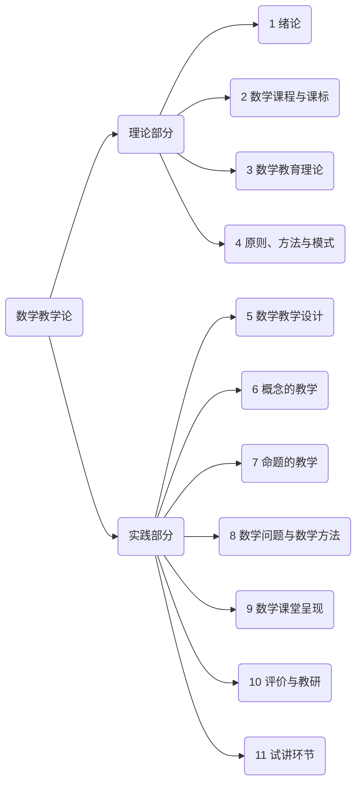

```mermaid
graph LR;
A("数学教学论")-->B1("理论部分")
A-->B2("实践部分")
B1-->C1("1 绪论")
B1-->C2("2 数学课程与课标")
B1-->C3("3 数学教育理论")
B1-->C4("4 原则、方法与模式")
B2-->C5("5 数学教学设计")
B2-->C6("6 概念的教学")
B2-->C7("7 命题的教学")
B2-->C8("8 数学问题与数学方法")
B2-->C9("9 数学课堂呈现")
B2-->C10("10 评价与教研")
B2-->D("11 试讲环节")
```