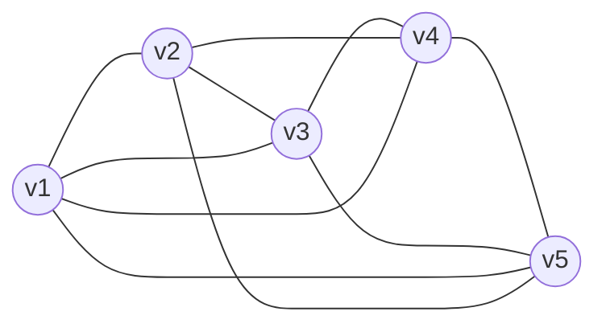

# 【图论笔记】图论基础（２）：子图、路、圈和树

图是顶点集和边集的有序二元组，而对顶点集或边集取其子集就会得到==子图==．

---

## 目录

+ <a href="#1">1. 子图的定义</a>
+ <a href="#2">2. 游走、迹和路</a>
+ <a href="#3">3. 闭游走、闭迹和圈</a>
+ <a href="#4">4. 连通图和树</a>
+ <a href="#5">5. 极大图和极小图</a>
+ <a href="/html/notes/graph-theory/graph-theory.html"> 返回【图论笔记】 </a>

---

## <a name="1"> 1. 子图的定义 </a>

设$G$和$H$都是图．
+ 如果$V(H)\subseteq V(G)$且$E(H)\subseteq E(G)$，则称$H$是$G$的==子图==．
    - 如果上述两个包含关系有至少一个是真包含，那么$H$是$G$的==真子图==。
+ 如果$V(H)\subseteq V(G)$且$E(H)\subseteq E(G)$，则称$H$是$G$的==支撑子图==．
+ 设$V(H)=U\subseteq V(G)$．对于$u,v\in U$，$u$和$v$在$H$中相邻当且仅当$u$和$v$在$G$中相邻，那么显然$H$是$G$的子图，我们称这样的子图$H$是==顶点子集$U$导出的子图==，记作$H=G[U]$．
+ 设$E(H)=S\subseteq E(G)$．$H$的顶点集$V(H)=\{v\in V(G)\mid S$有边与$v$关联$\}$，那么显然$H$是$G$的子图，我们称这样的子图$H$是==边子集$S$导出的子图==，记作$H=G[S]$．

子图还可以通过在图上删除一些顶点和边得到．

在图$G(V,E)$中，设$U$是$V$的子集，$S$是$E$的子集．
+ 设$H$是从$G$中删除边集$S$所得到的子图，则记 ==$H=G\setminus S$==；
+ 设$F$是从$G$中删除顶点集$U$同时删除$U$中顶点所关联的边而得到的子图，则记 ==$F=G\setminus U$==；
+ 如果$U$中只有一个顶点$u$，那么$G\setminus U$也记作 ==$G\setminus u$==；
+ 如果$S$中只有一个边$e$，那么$G\setminus S$也记作 ==$G\setminus e$==；
+ 设$G_1$是$G$的子图，也记作$G_1\subseteq G$，从$G$中删除$G_1$的顶点和边所得到的子图记作 ==$G\setminus G_1$==；

---

## <a name="2"> 2. 游走、迹和路 </a>

设$G(V,E)$是一个图，$\alpha:v_0e_1v_1e_1\dots e_rv_r$是一个由$G$中的顶点和边交替出现而构成的序列，其中$v_i\in V$，$e_i\in E$（$i\le r$）．
+ 如果序列$\alpha$中相邻两项相互关联，则称$\alpha$是$G$中的一个==游走==，$v_0$和$v_r$叫做这个游走的==端点==，$r$叫做这个游走的==长度==．
+ 如果$G$是简单图，那么游走$\alpha$中的边可以省略，从而将$\alpha$记作 ==$v_0v_1\dots v_r$==；
+ 如果游走中的边不重复，则称该游走为==迹==．
+ 如果游走中的顶点不重复，则称该游走为==路==．
+ 长度为$r$的路，叫做 ==$r$-路==．

> ==路没有重复边，所以路一定是迹，迹不一定是路==

图1

---

图1所示的图中，$v_1v_2v_3v_5v_2v_3v_4$是一条游走但不是迹，$v_1v_2v_4v_5v_2v_3$是一条迹但不是一条路，$v_1v_2v_3v_4v_5$是一条路．

> ==性质1.== 设$P$是一条路，那么$P$的端点的度为$1$，其他顶点的度为$2$．

> ==性质2.== 设$P$是一条路，那么$e(P)=v(P)-1$．

> ==证明.== 因为在路上删除端点会得到一条更短的路，所以可以对$v(P)$做归纳来证明．$\Box$

## <a name="3"> 3. 闭游走、闭迹和圈 </a>

设$G(V,E)$是一个图，$\alpha:v_0e_1v_1e_1\dots e_rv_r$是一个游走．
+ 如果$v_0$和$v_r$是同一个顶点，则称这个游走是一个==闭游走==．
+ 边不重复的闭游走叫做==闭迹==．
+ 除了起点和终点外没有重复顶点的闭游走叫==圈==．
+ 长度为$r$的圈叫$r$-圈

> ==圈没有重复边，所以圈是闭迹，但闭迹不一定是圈==．

> ==长度为1的圈是之前定义过的环，长度为2的圈是之前定义过的一对平行边，所以简单图上的圈的长度至少为$3$．==

图1所示的图中，$v_1v_2v_3v_5v_2v_3v_4v_1$是一个闭游走但不是闭迹，$v_1v_2v_4v_5v_2v_3v_1$是一个闭迹但不是一个圈，$v_1v_2v_3v_4v_5v_1$是一个圈．

> ==性质3.== 设$C$是一个圈，那么$C$的每个顶点的度都是$2$．

> ==性质4.== 设$C$是一个圈，那么$e(C)=v(C)$．

> ==证明.== 因为在圈上删除一条边会得到一条路，所以由性质 2 可知性质 4 成立．$\Box$

> ==性质5.== 设$G$是一个图且$G$上每个顶点的度都至少为$2$．那么$G$中必有一个子图是圈．

> ==证明.== 设$P=v_1v_2\dots v_t$是$G$上最长的一条路．因为$d(v_t)=2$，所以除了$v_{t-1}$外$v_t$还有一个邻点$u$，因为$P$是最长路，所以$u$是$v_1,v_2,\dots,v_t$中的某一个，这样就得到了一个圈． $\Box$

---

## <a name="4"> 4. 连通图和树 </a>

设$G(V,E)$是一个图．

+ 如果$V(G)=\emptyset$并且$E(G)=\emptyset$，则称$G$是==零图==
+ 没有边的图叫==空图==．
+ 只有一个顶底没有边的图叫==平凡图==．
+ 零图、空图、平凡图为了叙述方便才定义的．
+ 如果$G$上任意两顶点之间总有一条路相连，则称$G$是==连通图==．
+ 如果$G$上没有圈，则称$G$是==森林==．
+ 连通的森林叫==树==．

> ==性质6.== 非平凡的树上总有一度顶点．

> ==证明.== 设$T$是一个非平凡的树．因为$T$连通且非平凡，所以没有$0$度顶点．假设$T$没有一度顶点，那么$T$上所有顶点的度至少都是$2$．由性质 5 知，$T$有圈，矛盾． $\Box$

+ 图上的零度顶点叫做==孤立点==，一度顶点叫做==叶子==．

> ==性质7.== 设$T$是一个树，那么$e(T)=v(T)-1$．

> ==证明.== 设$T$是一个树．对$v(T)$做归纳．如果$v(T)=1$，那么$T$是平凡图，结论显然成立．假定$v(T)\le n-1$（$n\ge1$）时结论成立，现在考虑$v(T)=n$的情况．由性质 6 可知，$T$有叶子$v$，记$T'=T\setminus v$，显然$T'$仍然连通且无圈，所以$T'$仍然是树，但$v(T')<n$．由归纳假设知：$e(T')=v(T')-1=n-1-1=n-2$，所以$e(T)=e(T')+1=n-1$． $\Box$

> ==性质8. == 非平凡的树上至少有两个叶子．

> ==证明.== 设$T$是一个非平凡的树，$v(T)=n$．假设$T$只有一个叶子，那么由握手定理可知$2e(T)\ge 2(n-1)+1=2n-1$，所以$e(T)\ge n-\frac{1}{2}$．因为$e(T)$是整数，所以$e(T)\ge n$，与性质 7 矛盾．$\Box$

> ==性质9.== 树上任意两点之间有唯一一条路。

> ==证明.== 因为树连通，所以树上任意两顶点之间有路。假设某对顶点之间有两条路，那么这两路构成闭游走，又因为这两条路不重合，所以这个闭游走内必然含有圈，矛盾。$\Box$

---

## <a name="5"> 5. 极大图和极小图 </a>

+ 图的集合叫做==图族==。
+ 设$\mathcal{G}$是某个图论性质，事实上==它等价于一个图族==，即所有满足性质$\mathcal{G}$的图的集合，以后我们不区分二者。

+ 设$\mathcal{G}$是一个图族，如果$G\in\mathcal{G}$并且$G$的任何真子图不属于$\mathcal{G}$，那么就称$G$是图族$\mathcal{G}$中的==极大图==；如果$G\in\mathcal{G}$并且任何以$G$为真子图的图都不属于$\mathcal{G}$，那么就称$G$是$\mathcal{G}$中的==极大图==。
+ 图$G$的极大连通子图叫做$G$的==连通分支==。

> 注意：==极大不一定是最大，极小不一定是最小！==

> ==性质10.== 树是在所有同阶图中的极大无圈图。

> ==证明.== 设$T$是一个$n$阶图，任取一个$n$阶图$G$使得$T$是$G$的真子图，那么$V(T)=V(G)=V$，$E(T)\subset E(G)$。那么存在顶点$u,v\in V$，使得$uv\in E(G)$但$uv\not\in E(T)$。由性质9可知，$u,v$之间在$T$上有唯一的路$P$，显然，在$G$上$P$和$uv$构成圈，所以$G$含有圈。因此$T$是$n$阶图中的极大无圈图。$\Box$

> ==性质11.== 树是在所有同阶图中的极小连通图。

> ==证明.== 设$T$是一个$n$阶图，任取$T$的一个$n$阶的真子图$G$，那么$V(T)=V(G)=V$，$E(G)\subset E(T)$。那么存在顶点$u,v\in V$，使得$uv\in E(T)$但$uv\not\in E(G)$。由性质9可知，$u,v$之间在$T$上有唯一的路$P$，显然，$P=uv$。由于$P$在$T$上的唯一性，所以$G$上不含有连接$u,v$的路，所以$G$不连通。因此$T$是$n$阶图中的极小连通图。$\Box$

---

<a href="/html/notes/graph-theory/graph-theory.html"> 返回【图论笔记】 </a>

